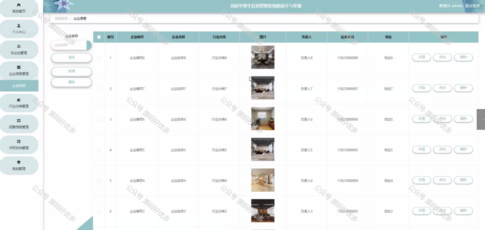
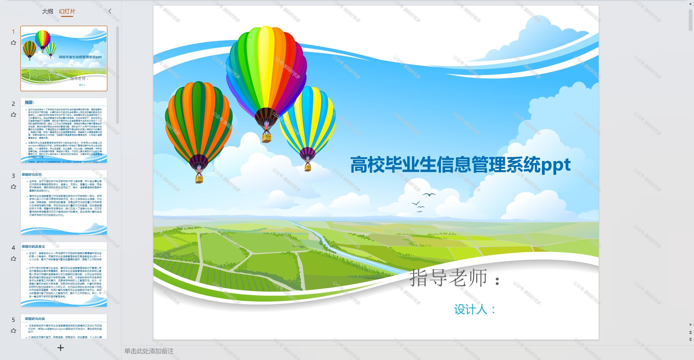

 
## 查看主页获取源码

### 一、作品包含

源码+数据库+设计文档万字+PPT+全套环境和工具资源+部署教程

### 二、项目技术

前端技术：Html、Css、Js、Vue、Element-ui

数据库：MySQL

后端技术：Java、Spring Boot、MyBatis

  

### 三、运行环境

开发工具：IDEA/eclipse

数据库：MySQL5.7

数据库管理工具：Navicat10以上版本

环境配置软件： JDK1.8+Maven3.6.3

前端Nodejs：14

### 四、项目介绍
项目编号：springbootA158

高校毕业生信息管理系统旨在应对日益增长的毕业生数据管理需求，提高高校就业指导工作效率，实现毕业生信息的规范化、数字化管理。随着高等教育规模的扩大，毕业生数量逐年上升，传统的手工管理方式已无法满足信息处理的及时性和准确性要求，因此，开发一套高效、便捷的信息管理系统显得尤为重要，它有助于高校更好地跟踪毕业生就业情况，为政策制定和教育教学改革提供数据支持。

前台用户功能：首页、招聘信息、招聘资讯、后台管理、个人中心。

后台分为管理员和用户
管理员的功能：系统首页、个人中心、毕业生管理、企业信息管理、行业分类管理、招聘信息管理、求职投档管理、系统管理。
用户的功能：系统首页、个人中心、求职投档管理。

### 五、运行截图

  
